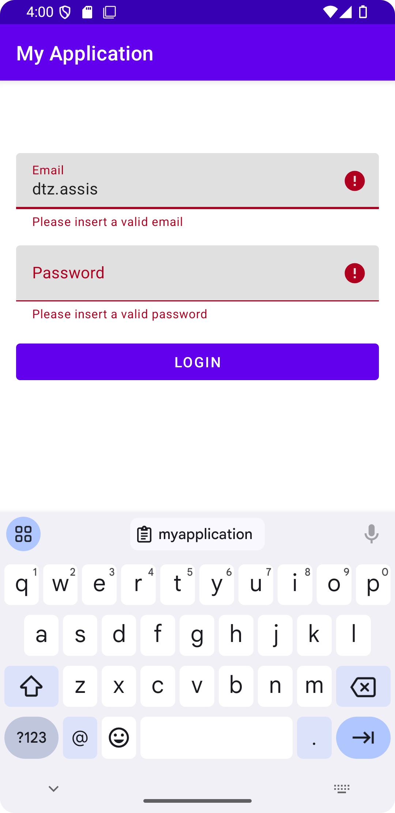
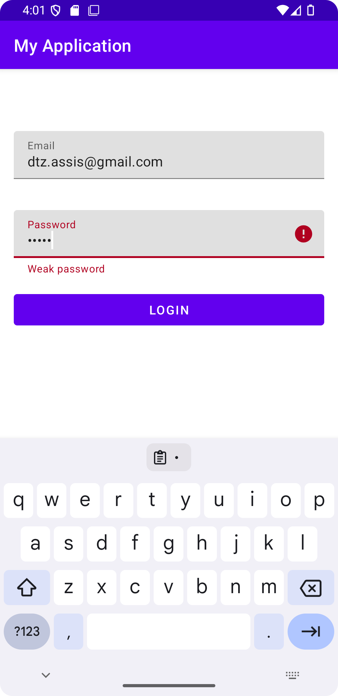
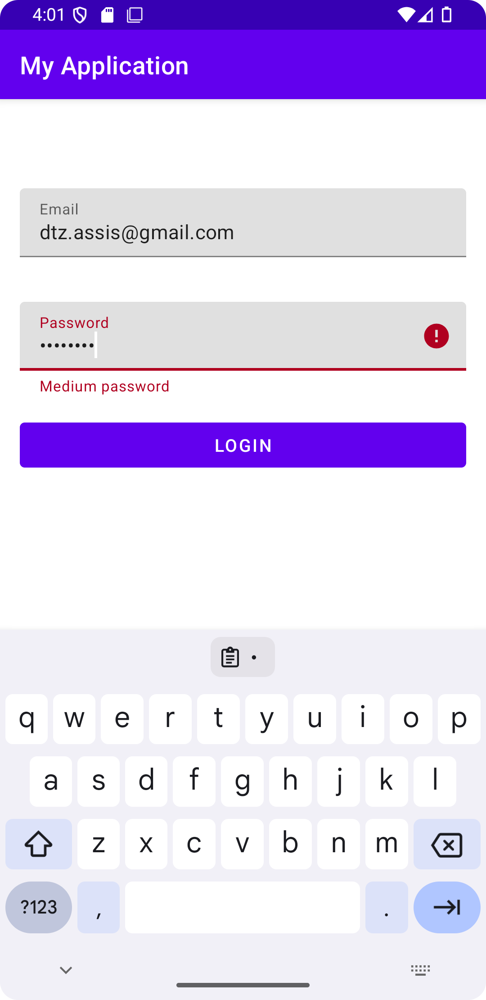
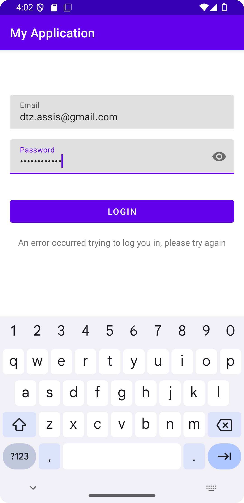
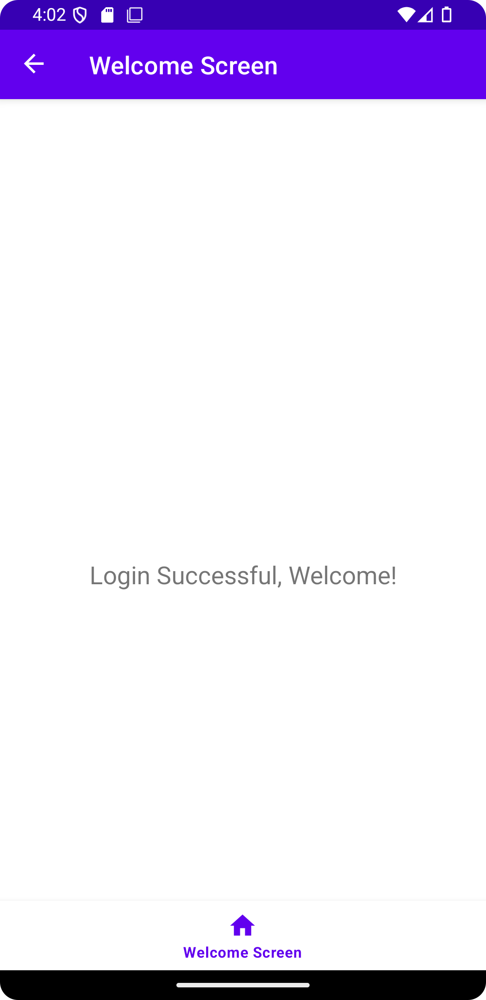

Taller Exercise — Android Clean Architecture Sample

This project demonstrates a clean implementation of Login + Welcome flow using Clean Architecture and SOLID principles in a simple Android app.

screenshots/login_screen.png

<table>
  <tr>
    <td>
      ### 🔐 Login Screen - Field Validation I
      
    </td>
    <td>
      ### 🔐 Login Screen - Field Validation II
      
    </td>
    <td>
      ### 🔐 Login Screen - Field Validation III
      
    </td>
    <td>
      ### 🔐 Login Screen - Login Error
      
    </td>
    <td>
      ### 🎉 Welcome Screen
      
    </td>
  </tr>
</table>

🧱 Architecture Overview

The app follows the Clean Architecture structure, dividing responsibilities into clear layers:

app/
├── di/                    # Dependency Injection setup (Koin)
├── login/
│   ├── model/            # ViewModels
│   ├── repository/       # Interfaces + Implementations (abstraction)
│   ├── state/            # UI State classes (StateFlow driven)
│   ├── ui/               # Activities & Fragments
│   └── usecase/          # Business logic / Use Cases
├── welcome/              # Welcome screen MVVM structure
└── TestApplication.kt    # Koin start point

🧩 How Clean Architecture is Applied

✅ Presentation Layer

LoginActivity, WelcomeFragment interact with ViewModels.

LoginViewModel exposes a StateFlow-driven LoginUiState, avoiding LiveData bloat.

✅ Domain Layer

Business logic is handled in usecase/:

LoginUseCaseImpl: Delegates login behavior to UserRepository

CredentialsValidatorUseCaseImpl: Responsible for input validation and password strength logic

✅ Data Layer

Interfaces like UserRepository are used to depend on abstractions.

UserRepositoryImpl provides a fake implementation, but is easily swappable due to DI.

✅ Dependency Injection

Uses Koin (AppModule.kt) for modular, testable dependency injection.

ViewModels and UseCases are injected where needed with constructor injection.

🔍 How SOLID Principles Were Applied

Principle

Application

S - SRP

LoginViewModel only handles UI state and flow. UseCaseImpls handle logic.

O - OCP

New use cases or validations can be added without modifying existing code.

L - LSP

LoginUseCaseImpl respects interface contracts and can be replaced freely.

I - ISP

Interface LoginUseCase keeps methods minimal and focused.

D - DIP

ViewModel and UseCases depend on abstractions (interfaces), injected via Koin.

🧪 Testing Strategy

Unit tests exist for all major logic classes:

LoginUseCaseImplTest.kt

CredentialsValidatorUseCaseImplTest.kt

LoginViewModelTest.kt

Mocks are created using MockK

ViewModel is tested with kotlinx.coroutines.test and InstantTaskExecutorRule

✅ Technologies Used

Kotlin

MVVM + Clean Architecture

Koin (DI)

Jetpack StateFlow (for UI state)

Material Design Components

Unit Testing with MockK, JUnit4

📂 Key Files to Explore

File

Purpose

LoginViewModel.kt

ViewModel for login state + events

LoginUiState.kt

Data class for UI screen state

CredentialsValidatorUseCaseImpl.kt

Logic for email/password validation and strength

LoginUseCaseImpl.kt

Calls repository to validate credentials

UserRepository.kt

Abstracts login logic

AppModule.kt

Koin module definitions
